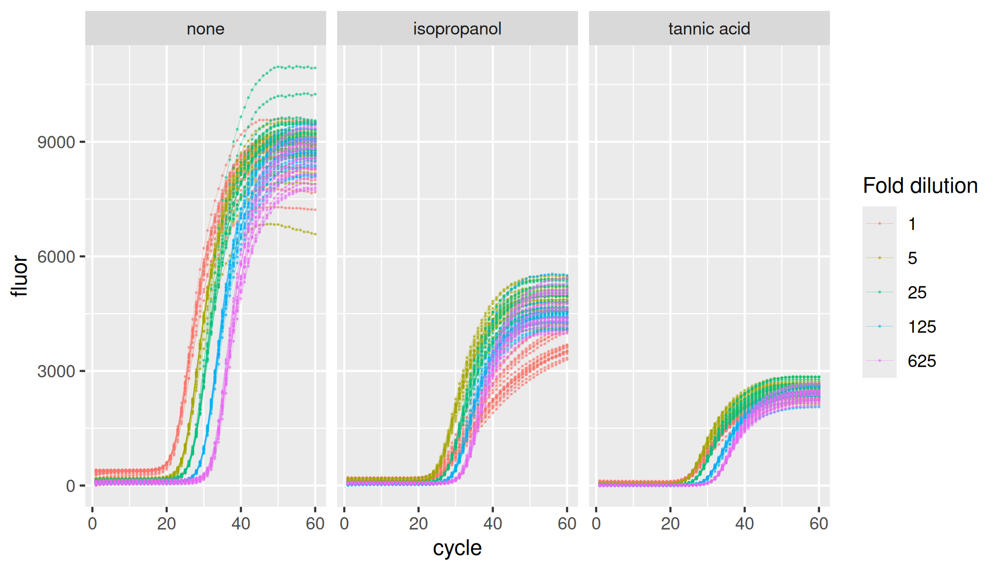

<!-- README.md is generated from README.Rmd. Please edit that file -->

# lievens

<!-- badges: start -->
<!-- badges: end -->

`{lievens}` provides Real-Time PCR Data Sets by Lievens et al. (2012).

## Installation

``` r
install.packages("lievens")
```

## Data

``` r
library(lievens)
library(ggplot2)

lievens |>
  ggplot(aes(x = cycle, y = fluor, group = interaction(plate, inhibitor, dilution, replicate), col = as.factor(dilution))) +
  geom_line(linewidth = 0.1, alpha = 0.5) +
  geom_point(size = 0.05, alpha = 0.5) +
  facet_wrap(vars(inhibitor)) +
  labs(color = "Fold dilution")
```


