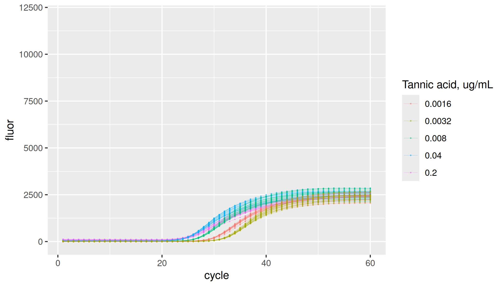

<!-- README.md is generated from README.Rmd. Please edit that file -->

# lievens

<!-- badges: start -->

[](https://CRAN.R-project.org/package=lievens)
[](https://github.com/ramiromagno/lievens/actions/workflows/R-CMD-check.yaml)
<!-- badges: end -->

`{lievens}` provides Real-Time PCR Data Sets by Lievens et al. (2012).

## Installation

``` r
install.packages("lievens")
```

## Data

Each sample group is defined by the inhibitor (“none”, “isopropanol”,
“tannic acid”), respective inhibitor concentration, and initial amplicon
copy number. Note that inhibitor concentration and initial copy number
of the amplicon are not independent of each other as concentrations are
obtained by co-dilution.

``` r
library(lievens)
library(ggplot2)
library(dplyr, warn.conflicts = FALSE)

lievens |>
  dplyr::distinct(plate, inhibitor, inhibitor_conc, copies, dilution)
#> # A tibble: 15 × 5
#>    plate           inhibitor   inhibitor_conc copies dilution
#>    <fct>           <fct>                <dbl>  <int>    <int>
#>  1 soy             none                0      100000        1
#>  2 soy             none                0       20000        5
#>  3 soy             none                0        4000       25
#>  4 soy             none                0         800      125
#>  5 soy             none                0         160      625
#>  6 soy+isopropanol isopropanol         2.5    100000        1
#>  7 soy+isopropanol isopropanol         0.5     20000        5
#>  8 soy+isopropanol isopropanol         0.1      4000       25
#>  9 soy+isopropanol isopropanol         0.02      800      125
#> 10 soy+isopropanol isopropanol         0.004     160      625
#> 11 soy+tannic acid tannic acid         0.2    100000        1
#> 12 soy+tannic acid tannic acid         0.04    20000        5
#> 13 soy+tannic acid tannic acid         0.008    4000       25
#> 14 soy+tannic acid tannic acid         0.0016    800      125
#> 15 soy+tannic acid tannic acid         0.0032    160      625
```

Here is the number of replicates per group:

``` r
lievens |>
  dplyr::distinct(plate, inhibitor, inhibitor_conc, copies, dilution, replicate) |>
  dplyr::count(plate, inhibitor, inhibitor_conc, copies, dilution) |>
  print(n = Inf)
#> # A tibble: 15 × 6
#>    plate           inhibitor   inhibitor_conc copies dilution     n
#>    <fct>           <fct>                <dbl>  <int>    <int> <int>
#>  1 soy             none                0         160      625    18
#>  2 soy             none                0         800      125    18
#>  3 soy             none                0        4000       25    18
#>  4 soy             none                0       20000        5    18
#>  5 soy             none                0      100000        1    18
#>  6 soy+isopropanol isopropanol         0.004     160      625    18
#>  7 soy+isopropanol isopropanol         0.02      800      125    18
#>  8 soy+isopropanol isopropanol         0.1      4000       25    18
#>  9 soy+isopropanol isopropanol         0.5     20000        5    18
#> 10 soy+isopropanol isopropanol         2.5    100000        1    18
#> 11 soy+tannic acid tannic acid         0.0016    800      125    18
#> 12 soy+tannic acid tannic acid         0.0032    160      625    18
#> 13 soy+tannic acid tannic acid         0.008    4000       25    18
#> 14 soy+tannic acid tannic acid         0.04    20000        5    18
#> 15 soy+tannic acid tannic acid         0.2    100000        1    18
```

## Standard dilution series

Most concentrated set of replicates in the dilution series have 100,000
copies of the soybean Lectin endogene (Le1) derived amplicon. Following
samples in the series are five-fold dilutions.

``` r
lievens |>
  dplyr::filter(inhibitor == "none") |>
  ggplot(aes(x = cycle, y = fluor, group = interaction(plate, inhibitor, dilution, replicate), col = as.factor(dilution))) +
  geom_line(linewidth = 0.1, alpha = 0.5) +
  geom_point(size = 0.05, alpha = 0.5) +
  labs(color = "Fold dilution") +
  ylim(-100, 12000)
```


## Inhibition by isopropanol

``` r
lievens |>
  dplyr::filter(inhibitor == "isopropanol") |>
  ggplot(aes(x = cycle, y = fluor, group = interaction(plate, inhibitor, inhibitor_conc, replicate), col = as.factor(inhibitor_conc))) +
  geom_line(linewidth = 0.1, alpha = 0.5) +
  geom_point(size = 0.05, alpha = 0.5) +
  labs(color = "Isopropanol, % (v/v)") +
  ylim(-100, 12000)
```


## Inhibition by tannic acid

``` r
lievens |>
  dplyr::filter(inhibitor == "tannic acid") |>
  ggplot(aes(x = cycle, y = fluor, group = interaction(plate, inhibitor, inhibitor_conc, replicate), col = as.factor(inhibitor_conc))) +
  geom_line(linewidth = 0.1, alpha = 0.5) +
  geom_point(size = 0.05, alpha = 0.5) +
  labs(color = "Tannic acid, ug/mL") +
  ylim(-100, 12000)
```


